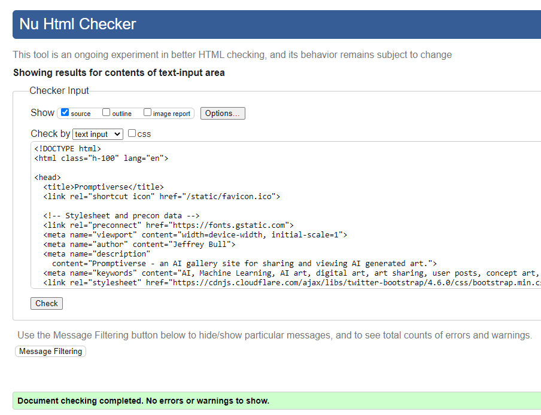
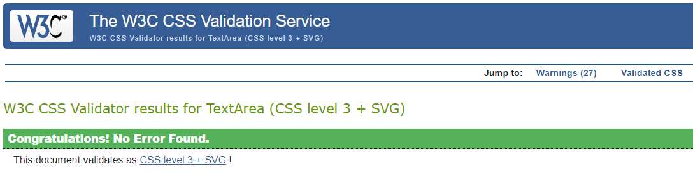
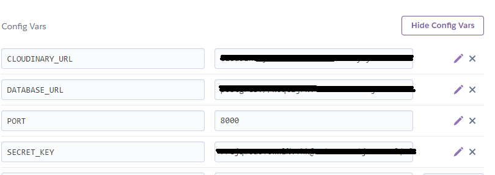

# **THE PROMPTIVERSE**

Digital gallery to post, rate and share AI art work.

[View live website here](https://cip4-digigallery.herokuapp.com)

<br />


<br />

## [**Table of Contents**](<#table-of-contents>)

<br />

* [**OVERVIEW**](<#overview>)
    * [Site Plan](<#site-plan>)
    * [Design Concept](<#design-concept>)
    * [User Stories & Agile](<#user-stories-and-agile>)
    * [Wireframes](<#wireframes>)
    * [User Interface](<#user-interface>)
    
<br />

* [**SITE FEATURES**](<#site-features>)
    * [Inherited Code](<#inherited-code>)
    * [Depreciated Code](<#depreciated-code>)
    * [Landing page](<#landing-page>)
    * [Modals](<#modals>)
    * [Login / Signup / Logout](<#login>)
    * [Gallery](<#gallery>)
    * [Post View](<#post-view>)
    * [Account Page](<#account-page>)
    * [Submit Post](<#submit-post>)
    * [Update Post](<#update-post>)
    * [Admin Panel](<#admin-panel>)
    * [User Feedback](<#user-feedback>)

<br />

* [**ROADMAP**](<#roadmap>)

<br />

* [**TECHNOLOGY USED**](<#technology-used>)
    * [Languages](<#languages>)
    * [Installed Libraries In Requirements](<#installed-libraries-in-requirements>)
    * [Other software & resources](<#other-software-libraries-and-resources>)
    * [Testing resources](<#testing-resources>)

<br />

* [**TESTING**](<#testing>)
    * [Fixed Bugs](<#fixed-bugs>)
    * [Known Issues](<#known-issues>)
    * [Manual Testing](<#manual-testing>)
    * [Validation](<#validation>)
    * [Lessons Learned](<#lessons-learned>)

<br />

* [DEPLOYMENT](<#deployment>)
<br />

* [CREDITS](<#credits>)
<br />

* [ACKNOWLEDGEMENTS](<#acknowledgements>)
<br />

--------------------------------------------------------
## **OVERVIEW**

### **Site Plan**
To showcase my learning for Project 4 on my CI course I decided to create a gallery website. This was going to be based on the very basic skeleton of the walkthrough blog project. I have a keen interest in art and creativity and recently have been blown away by advances in AI art generators. So marrying that interest with a project seemed a good place to start. 

--------------------------------------------------------

### **Design Concept**
Initially, I worked directly from the base walkthrough code to get me started. I have included the DB schema below but have not gone into too much detail as aside from some new fields it remains very similar to the original project models.py file.

<details>
<summary>Schema</summary>


</details>

It is worth noting (more details in lessons learned) I later realized a slightly different solution would have been cleaner, with the image separated into its own model.
But for the purpose of the project I worked from this base.

--------------------------------------------------------

### **User Stories and Agile**

A comprehensive git project page can be found here with my user stories. 

[Project Board](https://github.com/users/JeffreyBull76/projects/5)


I initially used similar stories to the example project but then added others more specific to this project. At all times during production, the user and admin roles were kept in mind when it came to implementing new functions and even the more aesthetic design ideas. This was in line with Agile methodology.

As you can see above on the project board, the user stories were followed and completed and some new ones were added for roadmap features. 

Hopefully I have shown throughout the project where ideas were tried and reverted, and were solutions were found that solved critical issues which would affect end users. 

--------------------------------------------------------

### **Wireframes**

<details>
<summary>I used an online wireframe tool to create my basic layout idea 

[Fluid UI](https://www.fluidui.com/)
</summary>


</details>

This design stayed mostly intact throughout the process. I did, in the end, decide to leave the login, signup, and logout pages separate because it felt cleaner in production. I left the wireframe as was to show my initial idea of showing them side by side.

All pages are fully responsive and work well on high res screens and mobiles.

In terms of how this relates to the templates in Django, it is as follows.
  * Base html: contains most scripts and base template
  * Index html: where the landing page loads and which then is extended by our app content when the user is logged in
  * Nav html: uses the 'include' jinja syntax to make sure it is always present on all content
  * Gallery html: extends index and loads the posts
  * Account html: extends index and loads user posts and account info
  * Post html: Loads detailed post info and user comments extends index
  * Create/Update html: the 2 pages which handle the creation and updating of post extends index
  * Error pages: Custom error pages with site navigation included

--------------------------------------------------------

### **Final Design**

* Two fonts were chosen:
    * Julius Sans One: Was used for our headers and decorative text. 
    * Poppins: Was used for the main body text elements to give a little more weight

<br />


<br />


<br />

* Color palette
    * Was done in a muted greyscale with an orange 'pop' color to prevent detracting from the artwork


* Overall Thoughts: All design elements were chosen to be somewhat neutral and not make the site too busy.


--------------------------------------------------------

### **User Interface**

The nav bar exists in two versions.

* Logged out

* Logged in


In the logged-out version, only the top grey bar is visible. This design choice was taken to differentiate the two states more clearly. I also felt the second bar (in orange) created a nice visual gap between the site's content and our header. As the site mostly just consists of image cards and little to no text. I felt that the visual line at the top was important. The orange bar helped frame the main content visually.

In terms of structure, the site will be designed with one aim in mind. To provide an interactive online gallery for users to share their artwork (and its generation method) with other users and allow for comments and feedback on the posted work.

The nav is kept very simple, as such a 'hamburger' version was not needed for mobiles. Though one may be needed in the future if the nav had more features added to it (see Roadmap)

--------------------------------------------------------

### [Contents Menu](<#table-of-contents>)

--------------------------------------------------------

## **SITE FEATURES**

### **Inherited Code**

It is worthy of note to point out the shared code from the walkthrough blog project on the CI course. The models and basic project structure were used as the foundation for this project. It was iterated on and extended substantially in the end, but I do want to acknowledge its shared lineage. As detailed later in this readme given the lessons I learned I would probably deviate away from that code base more if asked to create a new version of this.

<br />

### **Depreciated Code**
Below you will find code blocks for now removed and depreciated code. In each case, the code was either later refined or removed.

<br />

<details><summary>This first version of a post-submission function, worked but did not correctly gather and pre-populate user details. This in practice allowed users to select from a list to designate the author (as opposed to detecting the current user) as it was just inheriting from the base post model. In retrospect, a custom-built model could have avoided this (see Lessons Learned) but for the scope of the project, the solution was to simply rewrite our submission function (see live code). This allowed me to add other functionality and security. Note the code presented here was done in a test environment on my previous walkthrough project.</summary>

VIEW:
```class Submission(View):
        def get(self, request, *args, **kwargs):
            queryset = Post.objects

            return render(
                request,
                'submit_post.html',
                {
                    "submit_form": SubmitForm(),
                }
            )
```

FORM:
```class SubmitForm(forms.ModelForm):
        class Meta:
            model = Post
            fields = ('author', 'title', 'content', 'slug', 'excerpt',)
```
</details>

<br />
    
<details><summary>This Code below is presented to show the old SubmitForm code. Later tidied up and moved into one block (see live code)</summary>

OLD CODE:
```def clean(self):
        cleaned_data = super().clean()
        title = cleaned_data.get('title')
        if title:
            slug = slugify(title)
            if Post.objects.filter(slug=slug).exists():
                raise forms.ValidationError("This title already exists.")
            cleaned_data['slug'] = slugify(title)
        return cleaned_data

      def clean_slug(self):
        slug = slugify(self.cleaned_data['title'])
        count = 1
        while Post.objects.filter(slug=slug).exists():
            slug = f'{slug}-{count}'
            count += 1
        return slug
```
</details>

<br />

<details><summary>Old code for now removed the comments section on the account page</summary>

OLD TEMPLATE CODE:
```<!-- shows all comments by current user and allows them to be deleted -->
  <div class="container-fluid">
    <p>COMMENT LIST:</p>
    <div class="row">
      <!-- comments section displays user feedback -->
      
      <div class="col-lg-3 col-md-4 col-sm-12 col-12">
        <div class="card mb-3" id="comment-card">
          <div class="card-header">
            {{ comment.name }} said on {{ comment.created_on }}:
          </div>
          <div class="card-body">
            <p>{{ comment.body }}</p>
            
            <a href="?page=account"
              class="btn btn-danger btn-sm float-right">Delete</a>
            
          </div>
        </div>
      </div>
      
      <!-- displays a message when no comments are present -->
      <p>No comments yet.</p>
      
    </div>
  </div>
```

OLD VIEW CODE (added under AuthorPostList)
```def get_context_data(self, **kwargs):
        context = super().get_context_data(**kwargs)
        user_comments = Comment.objects.filter(name=self.request.user.username)
        context['user_comments'] = user_comments
        return context
```

</details>

<br />

### **Live Code**
I have added extensive annotation to all my Python files in the live code which details its function and how it was built. This of course could be edited down in a production version but it is included here to show what was learned. Please refer to forms.py, views.py, urls.py, and admin.py.

### **Models.py file**
One thing to note here is the Models.py file and how it was altered for my project. I removed the excerpt and updated_on fields. The former was not needed due to the difference in the structure of my posts. I decided to remove the latter purely because I wasn't displaying that information prominently on the site so it seemed pointless to include it. It could easily be added back in if required. The 'content' field in the original model is here split into 3 fields, the image prompt information, negative prompt, and production method.

<br />

### **Landing Page**

The landing page was left deliberately sparse as the site itself is quite busy with images. The text hopefully conveys the idea behind the site, but it is not a site designed to attract 'wandering' users in the way a shop front might be. A certain level of knowledge of the subject matter (or at least an interest in digital art) is assumed.  In a real-world setting, it would be shared and advertised on social feeds of art creators and linked to posts about AI art.

<details><summary>Landing Page Image</summary>


</details>

<details><summary>Landing Page Bottom</summary>


</details>

<br />

### **Modals**

Two modals can be found on the base page the 'Hero section' or 'About' modal and the 'Privacy / Legal' modal (the latter being available throughout the site). Both are fairly self-explanatory so are not included in great detail here. Built using bootstraps base styles and some custom css.

<br />

### **Login**

The login page is shown here (the design is consistent through both other pages, namely signup, and logout) it uses the base templates in the same way the walkthrough project did for ease and functionality and avoids rewriting code.

<details><summary>Login</summary>


</details>

<br />

### **Gallery**

Once signed in the user is presented with a gallery, which displays all the images in a responsive column layout. Initially, a masonry grid layout was ideated. This proved very difficult to combine with my dynamically built gallery (using jinja syntax) which builds the collection of images, ultimately that solution was abandoned. If a future version was built with different technologies (using react and Cloudinary built-in features) this could be reinstated. But ultimately the live version presented was a good compromise that wasn't too complex.

A few other versions were tried but none worked satisfactorily. In the end, I found an online resource that had a column-based layout (see tech used section). This was then tweaked to meet the site's needs.

*I also tested a paginated solution here but it ultimately didn't work well with responsive layouts. It would require a lot of callback scripting to make it recognize the user's device and responsively paginate. So the idea was scrapped. (In an infinite loading layout masonry grid as mentioned above, this could be reinstated)*

<details><summary>Gallery</summary>


</details>

<br />

The gallery itself is constructed of bootstrap 'card' elements (with fairly heavy styling applied to remove most text elements) They are fluid image-based cards that are fully responsive. They feature a gentle rollover animation (removed for mobiles to avoid issues with the touchscreen)

I used a tutorial (see Technology used) and then extended it to create an animation that loads each gallery image when the user scrolls down (using intersection observer) Clicking the image navigates to the post detail page.

<details><summary>Card Element</summary>


</details>

<br />

### **Post View**

Here we have the post detail page, which shows the image and related prompt information once clicked on from the Gallery page. It allows users to comment underneath their own or other people's posts. The comment approval process was removed as only registered users can comment, this may have to be revisited in a live version (see roadmap for future ideas regarding this page)

The post information fields are clickable to copy the content to the clipboard for easy replication.

*Under known bugs, you will see a reference to a strange error in rendering that sometimes prevents the vertical scroll bar rendering. This is extremely hard to track down I have tried simplified layouts, of all shapes and sizes but it persists. See the bugs section for more detail.*

<details><summary>Post View</summary>


</details>

<br />

<details><summary>Comments Section</summary>


</details>

<br />

### **Account Page**

  The account page has a similar layout to the gallery but with extra functionality. Such as Admin publishing with one button for draft posts. It shows all posts by the logged-in user and allows for one button updating or deleting of those. An earlier design draft also had all user comments listed here, but following a mentor session it was decided this was a messy layout that served little purpose, so it was removed (see depreciated code)
 
  With the deletion of posts, we also make sure the related Cloudinary image is also deleted to prevent the account from being clogged with old defunct images.
  
  Also included here are 'coming soon' tags to show planned future functionality.

<details><summary>Account Page</summary>


</details>

<br />

### **Submit Post**

  The submit page allows users to submit their works, with a form built from our model and the image saved to Cloudinary. I would refer you to the forms.py and views.py for a detailed description of how this works. Getting Cloudinary upload to function was a fairly complex task but now works correctly.

<details><summary>Submit Post</summary>


</details>

<br />

### **Update Post**

  The update post page is identical to our submit form but with the image displayed next to it. It allows for the prompt information to be changed, but does not allow for images to be altered as these are integral to the post itself, and removing or changing them would invalidate the comments and feedback.

<br />

### **Admin Panel**

  The Admin panel is the same as the walkthrough with one extra piece of functionality added (see admin.py) which allows posts to be published from the drop-down, in the same way, delete works.

<details><summary>Admin Panel Main</summary>


</details>

<details><summary>Admin Panel Detail</summary>


</details>

<br />

### **User Feedback**

  Following mentor feedback, I added flash messages that confirm user actions. Also, a hard stop confirmation asks users to confirm the deletion of or updating of posts/comments with a JS popup.

<br />

--------------------------------------------------------

### [Contents Menu](<#table-of-contents>)
--------------------------------------------------------

## **ROADMAP**

  Here I will briefly touch on future features I would implement given more time and if the site were to go live.

* Change the like feature to an up / down vote feature (similar to Reddit): This would allow for more accurate tracking of post/image quality.
* Added Account page functionality: Where needed these would have their pages that render over the main account page.
  * Account settings: Such as registered date, profile image etc
  * User Posts: A list of all posts (by name) of the current user to allow easy navigation to them
  * User Comments: A list of all user comments (by Post name) and their related posts to allow for easy deletion and navigation
  * Likes Collected: A simple numerical display of likes gained.
  * Likes Given: A simple numerical display of likes given.
* Report comment feature: to allow users to report abusive comments which are made (an alternative would be comment approval but that seems cumbersome in a production setting)
* Gallery page search & filter: A way to refine the posts viewed based on keywords or tags (created on post at submission) This would be required as the site grew, but would require some rebuilding/reworking of our model and views. In theory, this would not be too complex to implement but seems to time consuming for the scope of the project.
* Cloudinary backend transformations: Another major issue would be implementing the Cloudinary widget to allow uploading and image transformation on submission. This would require reworking the model to detach the image from the post itself. Again while not too difficult it seemed beyond the scope of the project requirements.
* Comment approval: As above this seems cumbersome for a site with many users but may need to be revisited if issues arose.
* Hamburger menu: Not required now but may be needed if nav elements grew larger (as with say filtering and search functions)

--------------------------------------------------------

### [Contents Menu](<#table-of-contents>)
--------------------------------------------------------

## **TECHNOLOGY USED**
## **Languages**
  * [HTML](https://www.w3.org/standards/webdesign/htmlcss) - Base structure
  * [CSS](https://www.w3.org/standards/webdesign/htmlcss) - Style elements
  * [Javascript](https://developer.mozilla.org/en-US/docs/Web/javascript) - Some interactive elements
  * [Python](https://www.python.org/) - Backend functionality

<br />

## **Installed libraries in Requirements**
  * [asgiref](https://pypi.org/project/asgiref/)
  * [cloudinary](https://pypi.org/project/cloudinary/)
  * [dj-database-url](https://pypi.org/project/dj-database-url/)
  * [dj3-cloudinary-storage](https://pypi.org/project/dj3-cloudinary-storage/)
  * [Django](https://pypi.org/project/Django/)
  * [django-allauth](https://pypi.org/project/django-allauth/)
  * [django-crispy-forms](https://pypi.org/project/django-crispy-forms/)
  * [django-summernote](https://pypi.org/project/django-summernote/)
  * [gunicorn](https://pypi.org/project/gunicorn/)
  * [oauthlib](https://pypi.org/project/oauthlib/)
  * [Pillow](https://pypi.org/project/Pillow/)
  * [psycopg2](https://pypi.org/project/psycopg2/)
  * [PyJWT](https://pypi.org/project/PyJWT/)
  * [python3-openid](https://pypi.org/project/python3-openid/)
  * [pytz](https://pypi.org/project/pytz/)
  * [requests-oauhlib](https://pypi.org/project/requests-oauthlib/)
  * [sqlparse](https://pypi.org/project/sqlparse/)

<br />

## **Other software, libraries and resources**
  * [Bootstrap](https://getbootstrap.com/) - used for base style elements and layout
  * [Font Awesome](https://fontawesome.com/) - used for landing page icons
  * [Jquery](https://cdnjs.com/libraries/jquery) - used throughout the site
  * [Popper JS](https://cdnjs.com/libraries/popper.js) - Library used in forms.py
  * [Django](https://www.djangoproject.com/) - A model-view-template framework used to create the Review | Alliance site
  * [Fluid UI](https://www.fluidui.com/) - Wireframe resource
  * [Github](https://github.com/) - Used to host this repository
  * [Gitpod](https://www.gitpod.io) - Used to edit and push to the repo, the native validator was used to validate all Python code.
  * [Heroku](https://id.heroku.com/login) - Cloud platform the live site is deployed to
  * [Favicon](https://favicon.io/) - Used to create favicon
  * [Cloudinary](https://cloudinary.com/) - Hosts all static files in the project and user images
  * [LINK](https://www.youtube.com/watch?v=2IbRtjez6ag) - Link to a lesson that showed how to create a simple Intersection observer script, which was extended for my project
  * [LINK](https://www.w3resource.com/html-css-exercise/html-css-practical-exercises/html-css-practical-exercise-40.php) - Gallery code was taken from here then edited for use.
  * [LINK](http://animista.net) - Used to create the bounce button effect and slide-up image animation

<br />

## **Testing resources**
  * [HTML Validation](https://validator.w3.org/) - Used to validate HTML code
  * [CSS Validation](https://jigsaw.w3.org/css-validator/) - Used to validate CSS code
  * [JSHint Validation](https://jshint.com/) - Used to validate JavaScript code
  * [PyCodeStyle](https://pypi.org/project/pycodestyle/) - Used to validate all python code
  * [Lighthouse](https://developer.chrome.com/docs/lighthouse/overview/) - Performance testing resource
  * [Responsive Design Checker](https://www.responsivedesignchecker.com/) - Used for responsiveness check
  * [Google Chrome DevTools](https://developer.chrome.com/docs/devtools/) - Used throughout the project to debug and test
  * [Wave Web Accessibility Evaluation Tool](https://wave.webaim.org/) - Used to validate the site's accessibility

<br />

--------------------------------------------------------

### [Contents Menu](<#table-of-contents>)
--------------------------------------------------------

## **TESTING**

## **Fixed Bugs**
* In the old PostList view, we had an issue rendering the list correctly. This was fixed by using the super() function. It now populates our gallery correctly.
* Numerous layout bugs were discovered during testing and fixed (except for those listed in Known Issues)
* Originally the logout page was incorrectly overwriting the index template.
* Initially, the comments function threw numerous errors as it was not correctly reloading the page, this was fixed fairly early on.
* Numerous routing errors when redirecting to pages were corrected throughout the project.

<br />

## **Known Issues**

**Display issue with post detail page:** 
On first load, it sometimes prevents the Y scroll bar from displaying until the user enters text into the form. This only occurs on certain images and is difficult to pin down and replicate the base cause (See images below for example) NOTE It only prevents the scrollbar from displaying, scroll functionality is unaffected.

<details><summary>Vertical Scrollbar Bug Images for reference</summary>

<br />

Bugged Page issue - No vertical scrollbar showing !
<br />


Bugged Page Issue 2 - Now when text is entered scrollbar appears !
<br />


Non Bugged Page - Included for reference of correct load
<br />


</details>

  * I was able to fix it partially for some images but others still display this behavior. It appears to be related to the form and comments section rendering after the document loads. Even force rendering a vertical scrollbar did not fix this.
  * I suspect it is tied to how Django is dynamically loading the content of the image, post details, and comments section, and somehow the order this happens in with certain image sizes (happens more with smaller images) prevents the DOM elements loading in correctly (in this case meaning the vertical scroll bar fails to render)
  * As of the final stages of testing, I can confirm this is to do with the DOM not recognizing elements loaded below the 'First contentful paint' correctly, simply typing any text in the comment text field will correctly show a vertical scroll bar (see example images above). While this is the issue I still cannot quite pin down why this happens with some images and not others.
  * I have left this in for now as it's merely a problem with the display NOT functionality, you are still able to scroll with the mouse wheel and arrow keys. But in a live version, I would need to pin this down and fix it, despite it having minimal impact on site use.

<br />
  
**Scrapped Solution to file format on upload** Due to the lack of a Cloudinary widget and how the model works it was extremely difficult to set up native image transformation when communicating with the Cloudinary API. In a live version, this could be addressed by redesigning the aforementioned model (as detailed previously in roadmap). For sake of record I did ideate a fix that used the following imports (see below) It used a custom function to force new uploads to be transformed to webp format (reducing file size and increasing accessibility) However this then caused our delete image function to cease working (as the file extension did not match) so the code was scrapped and this issue relegated to a roadmap feature as it is not critical.
  * **Imports used in scrapped solution were as follows:**
  * from Django import forms
  * from PIL import Image
  * import io
  * from Cloudinary import uploader

<br />

## **Manual Testing**
All user stories marked as 'done' on our project board [HERE](https://github.com/users/JeffreyBull76/projects/5) were tested and signed off.

<br />

I did not have time to implement automated or unit tests. As the project is relatively straightforward I opted for manual testing. The results can be seen below.


| Status | **Landing Page** |
|:-------:|:--------|
| &check; | Custom 404 page exists and shows when the user manually enters an incorrect address extension |
| &check; | Clicking the title reloads to index.html landing page when not logged in |
| &check; | All landing page links navigate to the correct pages |
| &check; | All landing page modals open the correct panels |
| &check; | The landing page responds to different screen sizes correctly |
| &check; | Using the signup link work correctly and redirects to the gallery page |
| &check; | Using the login link work correctly and redirects to the gallery page |
| &check; | All scripts and resources load correctly |
| &check; | The footer at the bottom shows correctly and the modal works |

<br />

| Status | **Gallery Page**
|:-------:|:--------|
| &check; | Custom 404 page exists and shows when the user manually enters an incorrect address extension |
| &check; | The Gallery page only shows for logged users, it is unreachable otherwise |
| &check; | The Gallery page loads the post cards in a dynamic masonry gallery correctly |
| &check; | On scroll new images become visible correctly using an intersection observer API |
| &check; | The Main navigation links change to show account access and logout once signed in |
| &check; | The Gallery navigation bar shows correctly once the user is logged in |
| &check; | Gallery navigation bar links work correctly and redirect to the main gallery and submission form respectively |
| &check; | Clicking the title when logged in correctly redirects to the gallery |
| &check; | On new posts do not show in the gallery until published by superuser/staff |
| &check; | Hovering over an image on desktop systems correctly fades in the image title, likes, and comments counters |
| &check; | The hover function is correctly disabled on mobile and tablets |
| &check; | All navigation links work correctly from the gallery page |
| &check; | Clicking an image card takes you to the correct post details page |
| &check; | The footer at the bottom shows correctly and the modal works |

<br />

| Status | **Post Detail Page**
|:-------:|:--------|
| &check; | Custom 404 page exists and shows when the user manually enters an incorrect address extension |
| &check; | Post details page only shows for logged users | 
| &check; | On entering the page our view renders the post details and its relevant parameters to the fields | 
| &cross; | Post detail page is bug-free (see known issues) |
| &check; | All navigation links work correctly from this page |
| &check; | Below the image the likes and comments counter appears correctly |
| &check; | Clicking the like button toggles the like status for the current user |
| &check; | A comment box form loads at the bottom of the page allowing users to post comments |
| &check; | Posted comments render to the bottom left and correctly display a 'delete' button to the comment author |
| &check; | Posting a comment automatically refreshes the page and reverse redirects |
| &check; | The post text fields correctly allow for one-button copying to the clipboard via a script |
| &check; | The footer at the bottom shows correctly and the modal works |

<br />

| Status | **Submit Post Page**
|:-------:|:--------|
| &check; | Custom 404 page exists and shows when the user manually enters an incorrect address extension |
| &check; | All navigation links work correctly from this page |
| &check; | Submit post page only shows for logged users | 
| &check; | On entering the page the instructions panel shows correctly on all screen sizes | 
| &check; | On entering the page our submission form renders correctly based on our Post model |
| &check; | All form fields are error checked to prevent empty submissions |
| &check; | On error correctly flags page as posted to prevent form clearly and redirects to self |
| &check; | The title field checks for a unique name and correctly slugifies this data |
| &check; | The form automatically detects the logged user and attaches their details to the submitted data |
| &check; | The image field has a check in place to prevent data over 1MB from being submitted (temporary solution) |
| &check; | Clicking submit correctly commits the data to the database and sends the image to Cloudinary |
| &check; | Submitting data correctly redirects users back to the gallery page |
| &check; | The footer at the bottom shows correctly and the modal works |

<br />

| Status | **Update Post Page**
|:-------:|:--------|
| &check; | Custom 404 page exists and shows when the user manually enters an incorrect address extension |
| &check; | All navigation links work correctly from this page |
| &check; | update post page only accessible for logged users | 
| &check; | On entering the page form renders with the same formatting as post view page |
| &check; | All form fields are Pre-populated with existing post details |
| &check; | All form fields are error checked to prevent empty submissions |
| &check; | When an error is encountered redirects the user to the current page |
| &check; | Submitting data correctly redirects users back to the account page |
| &check; | The footer at the bottom shows correctly and the modal works |

<br />

| Status | **Account Page**
|:-------:|:--------|
| &check; | Custom 404 page exists and shows when the user manually enters an incorrect address extension |
| &check; | All navigation links work correctly from this page |
| &check; | Account page only shows for logged users and shows their names correctly | 
| &check; | Account page shows an admin button for superusers/staff only, allowing for easy navigation to the admin panel |
| &check; | Correctly populates a list of draft posts for superusers/staff and allows for one-button publishing |
| &check; | Correctly populates a list of user's own posts and allows for one-button updating and deletion |
| &check; | All deletion and update actions require confirmation on request and show flash messages |
| &check; | All redirects work conditionally to redirect to the account page |
| &check; | Post deletion process also removes the image from Cloudinary |
| &check; | All dynamic load animations for the gallery are removed from the account page|
| &check; | The footer at the bottom shows correctly and the modal works |

<br />

| Status | **Admin Page**
|:-------:|:--------|
| &check; | Custom 404 page exists and shows when the user manually enters an incorrect address extension |
| &check; | All standard admin functionality is available | 
| &check; | Extra function to allow mass publishing from dropdown present and working |
| &check; | All form data is admissable from the Admin panel in line with the model |
| &check; | Users are able to navigate back to the site easily |

<br />

## **Validation**
  **HTML validation:**
  All code was manually fed into the validator. Various duplicate ID errors and missing alt tags were fixed. 
  Now returns no errors on all pages.
  <details><summary>HTML Validation</summary>
  
  <br />

  Landing page:

  

  <br />

  Gallery page:

  

  <br />

  Submit post page:

  

  <br />

  Login page (all signup and logout pages use same template):

  

  <br />

  Post page:

  

  <br />

  Update post page:

  

  <br />

  Account page:

  

  <br />

  </details>

  <br />

  **CSS validation:**
  All code was manually fed into the validator. Returns no errors.
  <details><summary>CSS Validation</summary>

  CSS validation:

  

  <br />

  </details>
  
  <br />

  **Javascript validation:**
  All code tested returns no errors. 
  
  Warnings relate to very old browser compatibility, I have left these as the browsers in question have very little coverage.
  
  <details><summary>JS Validation</summary>

  Account page:

  

  <br />

  </details>
  
  <br />

  **Lighthouse testing:**
  Lighthouse tests can be seen below. This score was good for my landing page but shows a subpar score for the gallery page (see images) 
  
  This was mostly down to the following factors
  * Largest Contentful Paint: This is exacerbated by loading many images lazily. 
  * Image sizes not specified on load: Due to the images loading full size then being scaled it hurts the score (Potential fix see below)
  * Sheer amount of posts loading: This is unavoidable but in production a solution would be required (see below)
  * Cache policy: Beyond the scope of this project

  With the above in mind, I tried various solutions. At one stage we used Cloudinarys 'shrinkwrap' library to dynamically resize images but it did not prevent load times and offered little benefit for lots of extra scripting, I considered this a subpar solution. Removing the column layout improved the score by 5%  but again this was considered a nominal gain for a large loss of functionality.
  Overall one of the aforementioned Roadmap features (the Cloudinary widget) and the redesign of the model and view handling image serving would fix this issue. We could with that specify image sizes on the fly and have Cloudinary serve the correct size for the device. However, to implement that functionality would require React and/or Angular (See lessons learned)

  <details><summary>Lighthouse testing</summary>

  Landing page:

  

  <br />

  Gallery Page:

  

  <br />

  Gallery Page issue view:

  

  <br />

  </details>
  
  <br />

  **Wave web accessibility test:**
  Was tested returning the following feedback:

  * Contrast error: is related to a decorative text element, not required for site use so is ignored.
  * Alert: Occurs due to header elements as we skip 1 level of heading (decided this was ok to leave as is).

  <details><summary>Wave web test</summary>

  Wave web test:

  

  <br />

  </details>

<br />

## **Lessons Learned**
  * Now at the end of this project, it is worth noting, were a live version to be required I would approach the models and DB structure differently, also the technology used.
    * I would separate the images into their own model which would make manipulating and serving them to the site much easier.
    * I would use react as this would allow for far better communication between Cloudinary and the site. It would solve many of the niggles and performance issues I encountered. 
    * I would also separate the comments into their own model, so the comments sections could be made more like a forum thread under each image.
  * Using Angular and/or react: Seemed beyond the scope of this project. As a proof of concept it remains a solid starting point, in production using one of those frameworks would solve many of the issues above.
  * I feel with the above taken into account and recognized it serves as a good base for a project which could be reworked or ideated on in future versions.

<br />

--------------------------------------------------------

### [Contents Menu](<#table-of-contents>)
--------------------------------------------------------

## **DEPLOYMENT**

* Code was written in Gitpod by creating a repo from the initial CI full template [HERE](https://github.com/Code-Institute-Org/gitpod-full-template)
* ### Forking the repository
  * A copy of the GitHub Repository can be made by forking the GitHub account. This copy can be viewed and changes can be made to the copy without affecting the original repository. Take the following steps to fork the repository;
  * Log in to GitHub and locate the repository.
  * On the right-hand side of the page in line with the repository name is a button called 'Fork', click on the button to create a copy of the original repository in your GitHub Account.

<br />

* ### Cloning the repository
  * Under the repo’s name, click on the code tab.
  * In the Clone with HTTPS section, click on the clipboard icon to copy the given URL.
  * In your IDE of choice, open Git Bash.
  * Change the current working directory to the location where you want the cloned directory to be made.
  * Type git clone, and then paste the URL copied from GitHub.
  * Press enter and the local clone will be created.

<br />

* ### Deploying to Heroku
  * Ensure requirements.txt is up to date with pip freeze --local > requirement.txt - Vital so that Heroku knows what packages and dependencies are being used.
  * An ignore file is used with an env.py file to prevent secure data from being published to git
  * Make sure to set debug to "DEBUG = 'DEVELOPMENT' in os.environ" so that Heroku will not run in debug mode
  * Make sure the current working branch is up to date and pushed to GitHub correctly
  * Login to Heroku using 2 step authentication
  * Once logged create a new app in Heroku.
  * Set the config vars of the new app in heroku to reflect the dependencies in the app (see below)
  * Link the app to our GitHub repo (see below)
  * This was then deployed manually to ensure control over the live version
  * You do this by navigating to the deploy tab and selecting manual or automatic.
  * Check the build log for a successful build.

<details><summary>Config Vars redacted</summary>


</details>

<br />

<details><summary>Link repo</summary>


</details>

<br />
 
--------------------------------------------------------

### [Contents Menu](<#table-of-contents>)
--------------------------------------------------------

## **CREDITS**

All images used on the site are created by Jeffrey Bull using Stable Diffusion or related services such [Leonardo AI](https://leonardo.ai/)
(All work is public domain due to inherited licenses)

--------------------------------------------------------

### [Contents Menu](<#table-of-contents>)
--------------------------------------------------------

## **ACKNOWLEDGEMENTS**

Thanks in no particular order to my wife (for putting up with hearing me shout at my laptop a lot) my Mentor who guided me and stopped the project from spiraling into oblivion, my fellow CI slackers and CI staff who helped me with issues along the way (they know who they are!)

--------------------------------------------------------

### [Contents Menu](<#table-of-contents>)
--------------------------------------------------------