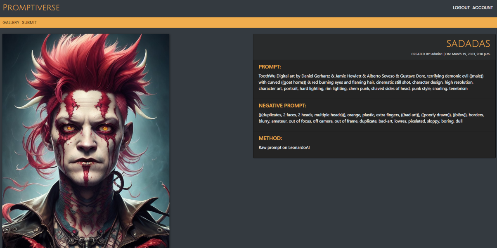

# **THE PROMPTIVERSE**

Digital gallery to post, rate and share AI art work.

[View live website here](https://cip4-digigallery.herokuapp.com)

<br />


<br />

## [**Table of Contents**](<#table-of-contents>)

<br />

* [**OVERVIEW**](<#overview>)
    * [Site Plan](<#site-plan>)
    * [Design Concept](<#design-concept>)
    * [User Stories](<#user-stories>)
    * [Wireframes](<#wireframes>)
    * [User Interface](<#user-interface>)
    
<br />

* [**SITE FEATURES**](<#site-features>)
    * [Inherited Code](<#inherited-code>)
    * [Depreciated Code](<#depreciated-code>)
    * [Landing page](<#landing-page>)
    * [Modals](<#modals>)
    * [Login / Signup / Logout](<#login>)
    * [Gallery](<#gallery>)
    * [Post View](<#post-view>)
    * [Account Page](<#account-page>)
    * [Submit Post](<#submit-post>)
    * [Update Post](<#update-post>)
    * [Admin Panel](<#admin-panel>)

<br />

* [**ROADMAP**](<#roadmap>)

<br />

* [**TECHNOLOGY USED**](<#technology-used>)
    * [](<#>)
    * [](<#>)
    * [](<#>)
    * [](<#>)

<br />

* [**TESTING**](<#testing>)
    * [Fixed Bugs](<#fixed-bugs>)
    * [Known Issues](<#known-issues>)
    * [](<#>)
    * [](<#>)
    * [Lessons Learned](<#lessons-learned>)

<br />

* [DEPLOYMENT](<#deployment>)
<br />

* [CREDITS](<#credits>)
<br />

* [ACKNOWLEDGEMENTS](<#acknowledgements>)
<br />

--------------------------------------------------------
## **OVERVIEW**

### **Site Plan**
To showcase my learning for Project 4 on my CI course I decided to create a gallery website. This was going to be based on the very basic skeleton of the walkthrough blog project. I have a keen interest in art and creativity and recently have been blown away by advances in AI art generators. So marrying the that interest with a project seemed a good place to start. 

--------------------------------------------------------

### **Design Concept**
Initially I worked directly from the base walkthrough code to get me started. I have included the DB schema below but have not gone into to much detail as aside from some new fields it remains very similar to the original project models.py file.

<details>
<summary>Schema</summary>


</details>

It is worth noting (more details in lessons learned) I later realised a slightly different solution would have been cleaner, with the image seperated into its own model.
But for the purposes of the project I worked from this base.

--------------------------------------------------------

### **User Stories**

A comprehensive git project page can be found here with my user stories. 

[Project Board](https://github.com/users/JeffreyBull76/projects/5)

<br />

I initially used similar stories to the example project but then added more for my specific site. At all times during production the user and admin roles were kept in mind when it came to implementing new functions and even more asthetic design ideas.

--------------------------------------------------------

### **Wireframes**

<details>
<summary>I used an online wireframe tool to create my basic layout idea 

[Fluid UI](https://www.fluidui.com/)
</summary>


</details>

This design stayed mostly intact throughout the process. I did in the end decide to leave the login, signup and logout pages seperate because it felt cleaner in production. I left the wireframe as was to show my initial idea of showing them side by side. 

All pages are fully responsive and work well on high res screens and mobiles.

--------------------------------------------------------

### **Final Design**

* Two fonts were chosen:
    * Julius Sans One: Was used for our headers and decorative text. 
    * Poppins: Was used for the main body text elements to give a little more weight

<br />


<br />


<br />

* Color palette
    * Was done in a muted greyscale with an orange 'pop' color to prevent detracting from the artwork


* Overall Thoughts: All design elements were chosen to be somewhat neutral and not make the site too busy.


--------------------------------------------------------

### **User Interface**

The nav bar exists in two versions.

* Logged out

* Logged in


In the logged out version only the top grey bar is visible. This design choice was taken to differentiate the two states more clearly. I also felt the second bar (in orange) created a nice visual gap between the sites content and our header. As the site mostly just consists of image cards and little to no text. I felt that visual line at the top was important. The orange bar helped frame the main content visually.

In terms of structure the site will be designed with one aim in mind. To provide an interactive online gallery for users to share their artwork (and its generation method) with other users and allow for comments and feedback on the posted work. 

The nav is kept very simple, as such a 'hamburger' version was not needed for mobiles. Though one my be needed in future if the nav had more features added to it (see Roadmap)

--------------------------------------------------------

### [Contents Menu](<#table-of-contents>)

--------------------------------------------------------

## **SITE FEATURES**

### **Inherited Code**

It is worthy of note to point out the shared code from the walkthrough blog project on the CI course. The models and basic project structure were used as the foundation for this project. It was iterated on and extended substantially in the end, but I do want to acknowledge its shared lineage. As detailed later in this readme given the lessonds I learned I would probably deviate away from that code base more if asked to create a new version of this.

<br />

### **Depreciated Code**
Below you will find code blocks for now removed and depreciated code. In each case the code was either later refined or removed. 

<br />

<details><summary>This first version of a post submission function, which worked but did not correctly gather and pre-populate user details. This in practice allowed users to select from a list to designate author (as opposed to detecting the current user) as it was just inheriting from the base post model. In retrospect a custom built model could have avoided this (see Lessons Learned) but for the scope of the project the solution was to simply rewrite our submission function (see live code). This allowwed me to add other functionality and security. Note the code presented here was done in a test environment on my previous walkthrough project.</summary>

VIEW:
```class Submission(View):
        def get(self, request, *args, **kwargs):
            queryset = Post.objects

            return render(
                request,
                'submit_post.html',
                {
                    "submit_form": SubmitForm(),
                }
            )
```

FORM:
```class SubmitForm(forms.ModelForm):
        class Meta:
            model = Post
            fields = ('author', 'title', 'content', 'slug', 'excerpt',)
```
</details>

<br />
    
<details><summary>This Code below is presented to show the old SubmitForm code. Later tidied up and moved into one block (see live code)</summary>

OLD CODE:
```def clean(self):
        cleaned_data = super().clean()
        title = cleaned_data.get('title')
        if title:
            slug = slugify(title)
            if Post.objects.filter(slug=slug).exists():
                raise forms.ValidationError("This title already exists.")
            cleaned_data['slug'] = slugify(title)
        return cleaned_data

      def clean_slug(self):
        slug = slugify(self.cleaned_data['title'])
        count = 1
        while Post.objects.filter(slug=slug).exists():
            slug = f'{slug}-{count}'
            count += 1
        return slug
```
</details>

<br />

<details><summary>Old code for now removed comments section on account page</summary>

OLD TEMPLATE CODE:
```<!-- shows all comments by current user and allows them to be deleted -->
  <div class="container-fluid">
    <p>COMMENT LIST:</p>
    <div class="row">
      <!-- comments section displays user feedback -->
      
      <div class="col-lg-3 col-md-4 col-sm-12 col-12">
        <div class="card mb-3" id="comment-card">
          <div class="card-header">
            {{ comment.name }} said on {{ comment.created_on }}:
          </div>
          <div class="card-body">
            <p>{{ comment.body }}</p>
            
            <a href="?page=account"
              class="btn btn-danger btn-sm float-right">Delete</a>
            
          </div>
        </div>
      </div>
      
      <!-- displays a message when no comments are present -->
      <p>No comments yet.</p>
      
    </div>
  </div>
```

OLD VIEW CODE (added under AuthorPostList)
```def get_context_data(self, **kwargs):
        context = super().get_context_data(**kwargs)
        user_comments = Comment.objects.filter(name=self.request.user.username)
        context['user_comments'] = user_comments
        return context
```

</details>

<br />

### **Live Code**
I have added extensive annotation to all my Python files in the live code which details its function and how it was built. This of course could be edited down in a production version but it is included here to show what was learned. Please refer to forms.py, views.py, urls.py and admin.py.

### **Models.py file**
One thing to note here is the Models.py file and how it was altered for my project. I removed the excerpt and updated_on fields. The former was not needed due to the difference in structure of my posts. I decided to remove the latter purely because I wasn't really displaying that information prominently on the site so it seemed pointless to include. It could easily be added back in if required. The 'content' field in the original model is here split into 3 fields, the image prompt information, negative prompt and production method.

<br />

### **Landing Page**

The landing page was left deliberately sparse as the site itself is quite busy with images. The text hopefully conveys the idea behind the site, but it is not a site designed to attract 'wandering' users in the way a shop front might be. A certain level of knowledge of the subject matter (or at least an interest in digital art) is assumed. In a real world setting it would be shared and advertised on social feeds of art creators and linked to posts about AI art. 

<details><summary>Landing Page Image</summary>


</details>

<details><summary>Landing Page Bottom</summary>


</details>

<br />

### **Modals**

Two modals can be found on the base page the 'Hero section' or 'About' modal and the 'Privacy / Legal' modal (the latter being available throughout the site). Both are fairly self explanatory so are not included in great detail here. Built using bootstraps base styles and some custome css.

<br />

### **Login**

The login page is shown here (the design is consistent through both other pages, namely signup and logout) it uses the base templates in the same way the walkthrough project did for ease and functionality and avoid rewriting code.

<details><summary>Login</summary>


</details>

<br />

### **Gallery**

Once signed in the user is presented with a gallery, this displays all the images in a responsive column layout. Initially a masonry flex layout was ideated. This proved very difficult to combine with my dynamically built gallery (using jinja syntax) which builds the collection of images. A few versions were attempted but none worked satisfactorily. In the end I found an online resource which had a column based layout [LINK](https://www.w3resource.com/html-css-exercise/html-css-practical-exercises/html-css-practical-exercise-40.php). This was then tweaked to meet the sites needs.

[LINK](https://www.youtube.com/watch?v=2IbRtjez6ag)

See above for a link to the tutorial I used for the gallery page. I used the concept then extended it to create an animation that loads each gallery image in when the user scrolls down (using intersection observer). Each post shows just the image and then a gentle bright flash animation on hover than also fades in the post title and like/comments counters. Clicking the image navigates to the post detail page. 

I note an issue with this page in the 'known issues' section later.

<details><summary>Gallery</summary>


</details>

<br />

### **Post View**

Here we have the post detail page, which shows the image and related prompt information once clicked on from the Gallery page. It allows users to comment underneath their own or other peoples posts. The comment approval process was removed as only registered users can comment, this may have to be revisited in a live version (see roadmap for future ideas regarding this page)

Under known bugs you will see reference to a strange error in rendering that sometimes stop a horizontal scroll bar rendering. This is extremely hard to track down I have tried simplified layouts, of all shapes and sizes but it persists. See bugs section for more detail.

<details><summary>Post View</summary>


</details>

<br />

<details><summary>Comments Section</summary>


</details>

<br />

### **Account Page**

  The account page, has a similar layout to the gallery but with extra functionality. Such as Admin publishing with one button for draft posts. It shows all posts by the logged in user and allows for one button updating or deleting of those. An earlier design draft also had all user comments listed here, but following a mentor session it was decided this was a messy layout which served little purpose, so it was removed (see deprecitated code)
 
  With the deletion of posts we also make sure the related cloudinary image is also deleted to prevent the account being clogged with old defunct images.
  
  Also included here are 'coming soon' tags to show planned future functionality.

<details><summary>Account Page</summary>


</details>

<br />

### **Submit Post**

  The submit page allows users to submit their own works, with a form built from our model and the image saved to Cloudinary. I would refer to the forms.py and views.py for a detailed description on how this works. Getting cloudinary upload functioning correctly was a fairly complex task but now works correctly.

<details><summary>Submit Post</summary>


</details>

<br />

### **Update Post**

  The update post page is identical to our submit form but with the image displayed next to it. It allows for the prompt information be changed, but does not allow for images to be altered as these are integral to the post itself and removing or changing them would invalidate the comments and feedback.

<br />

### **Admin Panel**

  The Amdin panel is the same as the walkthrough with one extra piece of functionality added (see admin.py) which allows posts to be published from the drop down in the same way delete works.

<details><summary>Admin Panel Main</summary>


</details>

<details><summary>Admin Panel Detail</summary>


</details>

<br />

--------------------------------------------------------

### [Contents Menu](<#table-of-contents>)
--------------------------------------------------------

## **ROADMAP**

  Here I will briefly touch on future features I would implement given more time and if the site were to go live.

* Change like feature to an  up / down vote feature (similar to reddit): Would allow for more accurate tracking of post/image quality.
* Added Account page functionality: Where needed these would have their own pages that rendered over the main account page.
  * Account settings: Such as registered date, profile image etc
  * User Posts: A list of all posts (by name) of the current user to allow easy navigation to them
  * User Comments: A list of all user comments (by Post name) and their related posts to allow for easy deletion and navigation
  * Likes Collected: A simple numerical display of likes gained.
  * Likes Given: A simple numerical display of likes given.
* Report comment feature: to allow users to report abusive comments which are made (an alternative would be comment approval but that seems cumbersome in a production setting)
* Gallery page search & filter: A way to refine the posts viewed based on keywords or tags (created on post at submission) This would be required as the site grew, but would require some rebuilding/reworking of our model and views. In theory this would not be to complex to implement but seems to time consuming for the scope of the project.
* Cloudinary backend transformations: Another major issue would be implementing the cloudinary widget to allow uploading and image transformation on submission. This would require reworking the model to detach the image from the post itself. Again while not to difficult it seemed beyond the scope of the project requirements.
* Comment approval: As above this seems cumbersome for a site with many users but may need to be revisited if issues arose.
* Hamburger menu: Not required now but may be needed if nav elements grew larger (as with say filtering and search functions)

--------------------------------------------------------

### [Contents Menu](<#table-of-contents>)
--------------------------------------------------------

## **TECHNOLOGY USED**

--------------------------------------------------------

### [Contents Menu](<#table-of-contents>)
--------------------------------------------------------

## **TESTING**

* **BUG NOTES:**
* In the old PostList view we had an issue rendering the list correctly. This was fixed by user the super() function. It now populates our gallery correctly.

* **KNOWN ISSUES:**
* Gallery page performance and possible changes to allow better extension in future.
* Display issue with post detail page, on first load it sometimes prevents the Y scroll bar display until the user enters text into the form. This only occurs on certain images and is difficult to pin down and replicate. I was able to fix it partially for some images but others still display this behaviour. It appears to be related to the form and comments section rendering after the document loads. It extremely hard to figure out, even simplifying the code into very straightforward layouts saw this behaviour appear on some images and not others. I suspect its tied to how django is dynamically loading the content of the image, post details and comments section, and somehow the order this happens with certain image sizes (happens more with smaller images) prevents the correct DOM elements loading in (in this case the vertical scroll bar)

I have left this in for now as its merely a problem with display NOT functionality, you are still able to scroll with mouse wheel and arrow keys. But in a live version I would need to pin this down and fix it, despite it having minimal impact on site use.

--------------------------------------------------------

### [Contents Menu](<#table-of-contents>)
--------------------------------------------------------

## **DEPLOYMENT**

--------------------------------------------------------

### [Contents Menu](<#table-of-contents>)
--------------------------------------------------------

## **CREDITS**

--------------------------------------------------------

### [Contents Menu](<#table-of-contents>)
--------------------------------------------------------

## **ACKNOWLEDGEMENTS**

--------------------------------------------------------

### [Contents Menu](<#table-of-contents>)
--------------------------------------------------------